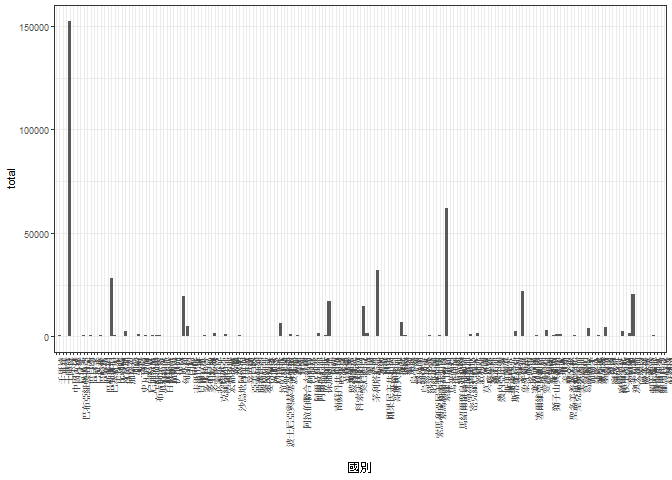
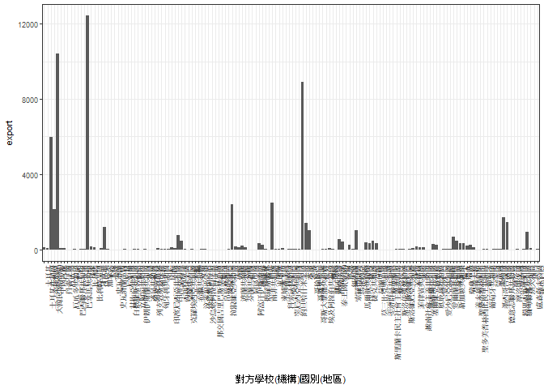

106-2 大數據分析方法 作業二
================
張嘉融

作業完整說明[連結](https://docs.google.com/document/d/1aLGSsGXhgOVgwzSg9JdaNz2qGPQJSoupDAQownkGf_I/edit?usp=sharing)

學習再也不限定在自己出生的國家，台灣每年有許多學生選擇就讀國外的大專院校，同時也有人多國外的學生來台灣就讀，透過分析[大專校院境外學生人數統計](https://data.gov.tw/dataset/6289)、[大專校院本國學生出國進修交流數](https://data.gov.tw/dataset/24730)、[世界各主要國家之我國留學生人數統計表](https://ws.moe.edu.tw/Download.ashx?u=C099358C81D4876CC7586B178A6BD6D5062C39FB76BDE7EC7685C1A3C0846BCDD2B4F4C2FE907C3E7E96F97D24487065577A728C59D4D9A4ECDFF432EA5A114C8B01E4AFECC637696DE4DAECA03BB417&n=4E402A02CE6F0B6C1B3C7E89FDA1FAD0B5DDFA6F3DA74E2DA06AE927F09433CFBC07A1910C169A1845D8EB78BD7D60D7414F74617F2A6B71DC86D17C9DA3781394EF5794EEA7363C&icon=..csv)可以了解103年以後各大專院校國際交流的情形。請同學分析以下議題，並以視覺化的方式呈現分析結果，呈現103年以後大專院校國際交流的情形。

來台境外生分析
--------------

### 資料匯入與處理

``` r
library(readr)
library(ggplot2)
library(readxl)
library(dplyr)
```

    ## 
    ## Attaching package: 'dplyr'

    ## The following objects are masked from 'package:stats':
    ## 
    ##     filter, lag

    ## The following objects are masked from 'package:base':
    ## 
    ##     intersect, setdiff, setequal, union

``` r
come103<-read_csv("http://stats.moe.gov.tw/files/detail/103/103_ab103_C.csv")
```

    ## Parsed with column specification:
    ## cols(
    ##   洲別 = col_character(),
    ##   國別 = col_character(),
    ##   `學位生-正式修讀學位外國生` = col_integer(),
    ##   `學位生-僑生(含港澳)` = col_integer(),
    ##   `學位生-正式修讀學位陸生` = col_integer(),
    ##   `非學位生-外國交換生` = col_integer(),
    ##   `非學位生-外國短期研習及個人選讀` = col_integer(),
    ##   `非學位生-大專附設華語文中心學生` = col_integer(),
    ##   `非學位生-大陸研修生` = col_integer(),
    ##   `非學位生-海青班` = col_integer(),
    ##   境外專班 = col_integer()
    ## )

``` r
school103<-read_csv("http://stats.moe.gov.tw/files/detail/103/103_ab103_S.csv")
```

    ## Parsed with column specification:
    ## cols(
    ##   學校類型 = col_character(),
    ##   學校代碼 = col_character(),
    ##   學校名稱 = col_character(),
    ##   `學位生-正式修讀學位外國生` = col_integer(),
    ##   `學位生-僑生(含港澳)` = col_integer(),
    ##   `學位生-正式修讀學位陸生` = col_integer(),
    ##   `非學位生-外國交換生` = col_integer(),
    ##   `非學位生-外國短期研習及個人選讀` = col_integer(),
    ##   `非學位生-大專附設華語文中心學生` = col_integer(),
    ##   `非學位生-大陸研修生` = col_character(),
    ##   `非學位生-海青班` = col_integer(),
    ##   境外專班 = col_integer()
    ## )

``` r
come104<-read_csv("http://stats.moe.gov.tw/files/detail/104/104_ab104_C.csv")
```

    ## Parsed with column specification:
    ## cols(
    ##   洲別 = col_character(),
    ##   國別 = col_character(),
    ##   `學位生-正式修讀學位外國生` = col_integer(),
    ##   `學位生-僑生(含港澳)` = col_integer(),
    ##   `學位生-正式修讀學位陸生` = col_integer(),
    ##   `非學位生-外國交換生` = col_integer(),
    ##   `非學位生-外國短期研習及個人選讀` = col_integer(),
    ##   `非學位生-大專附設華語文中心學生` = col_integer(),
    ##   `非學位生-大陸研修生` = col_integer(),
    ##   `非學位生-海青班` = col_integer(),
    ##   境外專班 = col_integer()
    ## )

``` r
school104<-read_csv("http://stats.moe.gov.tw/files/detail/104/104_ab104_S.csv")
```

    ## Parsed with column specification:
    ## cols(
    ##   學校類型 = col_character(),
    ##   學校代碼 = col_character(),
    ##   學校名稱 = col_character(),
    ##   `學位生-正式修讀學位外國生` = col_integer(),
    ##   `學位生-僑生(含港澳)` = col_integer(),
    ##   `學位生-正式修讀學位陸生` = col_integer(),
    ##   `非學位生-外國交換生` = col_integer(),
    ##   `非學位生-外國短期研習及個人選讀` = col_integer(),
    ##   `非學位生-大專附設華語文中心學生` = col_integer(),
    ##   `非學位生-大陸研修生` = col_character(),
    ##   `非學位生-海青班` = col_integer(),
    ##   境外專班 = col_integer()
    ## )

``` r
come105<-read_csv("http://stats.moe.gov.tw/files/detail/105/105_ab105_C.csv")
```

    ## Parsed with column specification:
    ## cols(
    ##   洲別 = col_character(),
    ##   國別 = col_character(),
    ##   學位生_正式修讀學位外國生 = col_integer(),
    ##   `學位生_僑生(含港澳)` = col_integer(),
    ##   學位生_正式修讀學位陸生 = col_integer(),
    ##   非學位生_外國交換生 = col_integer(),
    ##   非學位生_外國短期研習及個人選讀 = col_integer(),
    ##   非學位生_大專附設華語文中心學生 = col_integer(),
    ##   非學位生_大陸研修生 = col_integer(),
    ##   非學位生_海青班 = col_integer(),
    ##   境外專班 = col_integer()
    ## )

``` r
school105<-read_csv("http://stats.moe.gov.tw/files/detail/105/105_ab105_S.csv")
```

    ## Parsed with column specification:
    ## cols(
    ##   學校類型 = col_character(),
    ##   學校代碼 = col_character(),
    ##   學校名稱 = col_character(),
    ##   學位生_正式修讀學位外國生 = col_integer(),
    ##   `學位生_僑生(含港澳)` = col_integer(),
    ##   學位生_正式修讀學位陸生 = col_integer(),
    ##   非學位生_外國交換生 = col_integer(),
    ##   非學位生_外國短期研習及個人選讀 = col_integer(),
    ##   非學位生_大專附設華語文中心學生 = col_integer(),
    ##   非學位生_大陸研修生 = col_integer(),
    ##   非學位生_海青班 = col_integer(),
    ##   境外專班 = col_integer()
    ## )

``` r
come106<-read_csv("http://stats.moe.gov.tw/files/detail/106/106_ab105_C.csv")
```

    ## Parsed with column specification:
    ## cols(
    ##   洲別 = col_character(),
    ##   國別 = col_character(),
    ##   學位生_正式修讀學位外國生 = col_integer(),
    ##   `學位生_僑生(含港澳)` = col_integer(),
    ##   學位生_正式修讀學位陸生 = col_integer(),
    ##   非學位生_外國交換生 = col_integer(),
    ##   非學位生_外國短期研習及個人選讀 = col_integer(),
    ##   非學位生_大專附設華語文中心學生 = col_integer(),
    ##   非學位生_大陸研修生 = col_integer(),
    ##   非學位生_海青班 = col_integer(),
    ##   境外專班 = col_integer()
    ## )

``` r
school106<-read_csv("http://stats.moe.gov.tw/files/detail/106/106_ab105_S.csv")
```

    ## Parsed with column specification:
    ## cols(
    ##   學校類型 = col_character(),
    ##   學校代碼 = col_character(),
    ##   學校名稱 = col_character(),
    ##   學位生_正式修讀學位外國生 = col_integer(),
    ##   `學位生_僑生(含港澳)` = col_integer(),
    ##   學位生_正式修讀學位陸生 = col_integer(),
    ##   非學位生_外國交換生 = col_integer(),
    ##   非學位生_外國短期研習及個人選讀 = col_integer(),
    ##   非學位生_大專附設華語文中心學生 = col_integer(),
    ##   非學位生_大陸研修生 = col_integer(),
    ##   非學位生_海青班 = col_integer(),
    ##   境外專班 = col_integer()
    ## )

### 哪些國家來台灣唸書的學生最多呢？

``` r
#這是R Code Chunk
ForeignC<-merge(come103,come104,by="國別",all=T)
ForeignC2<-merge(come105,come106,by="國別",all=T)
ForeignT<-merge(ForeignC,ForeignC2,by="國別",all=T)
ForeignT<-ForeignT[,!grepl("洲",ForeignT)]
ForeignT$total<-rowSums(ForeignT[,-1],na.rm = T)

knitr::kable(head(ForeignT[order(ForeignT$total,decreasing = T),c(1,38)],10))
```

|     | 國別     |   total|
|-----|:---------|-------:|
| 5   | 中國大陸 |  152524|
| 114 | 馬來西亞 |   62031|
| 94  | 香港     |   31940|
| 17  | 日本     |   28200|
| 136 | 越南     |   21670|
| 168 | 澳門     |   20302|
| 38  | 印尼     |   19620|
| 80  | 南韓     |   16948|
| 90  | 美國     |   14846|
| 101 | 泰國     |    7035|

### 哪間大學的境外生最多呢？

``` r
ForeignSchool<-merge(school103[,c(-1,-2)],school104[,c(-1,-2)],by="學校名稱",all=T)
ForeignSchool2<-merge(school105[,c(-1,-2)],school106[,c(-1,-2)],by="學校名稱",all=T)
TS<-merge(ForeignSchool,ForeignSchool2,by="學校名稱",all=T)
for (i in 2:37){
  for (j in 1:165) {
    if (grepl("…",TS[j,i])){
      TS[j,i]<-""
      TS[j,i]<-as.numeric(TS[j,i])
    }else{
      TS[j,i]<-as.numeric(TS[j,i])
    }
  }
}
TS<-TS[,c(-8,-17)]
TS$total<-rowSums(TS[,-1],na.rm = T)
knitr::kable(head(TS[order(TS$total,decreasing = T),c(1,36)],10))
```

|     | 學校名稱         |  total|
|-----|:-----------------|------:|
| 130 | 無法區分校別     |  58472|
| 111 | 國立臺灣師範大學 |  22113|
| 108 | 國立臺灣大學     |  18199|
| 12  | 中國文化大學     |  16074|
| 153 | 銘傳大學         |  16057|
| 126 | 淡江大學         |  13887|
| 81  | 國立政治大學     |  11626|
| 74  | 國立成功大學     |  10982|
| 150 | 輔仁大學         |   9499|
| 127 | 逢甲大學         |   9474|

### 各個國家來台灣唸書的學生人數條狀圖

``` r
ggplot(data=ForeignT,
       aes(x=國別,y=total))+
  theme_bw(base_size = 8) +
  theme(axis.text.x=element_text(angle=90,hjust=1)) +
  geom_bar(stat="identity") 
```



### 各個國家來台灣唸書的學生人數面量圖

台灣學生國際交流分析
--------------------

### 資料匯入與處理

``` r
Ex<-read_excel("C:/Users/user/Desktop/Student_RPT_07.xlsx",skip = 1)
```

### 台灣大專院校的學生最喜歡去哪些國家進修交流呢？

``` r
gE<-group_by(Ex,`對方學校(機構)國別(地區)`)%>%
  summarise(export=sum(小計))%>%
  arrange(desc(export))
  knitr::kable(head(gE,10))
```

| 對方學校(機構)國別(地區) |  export|
|:-------------------------|-------:|
| 日本                     |   12430|
| 中國大陸                 |   10429|
| 美國                     |    8916|
| 大陸地區                 |    5996|
| 南韓                     |    2498|
| 法國                     |    2415|
| 大韓民國(南韓)           |    2131|
| 德國                     |    1706|
| 德意志聯邦共和國         |    1458|
| 英國                     |    1416|

### 哪間大學的出國交流學生數最多呢？

``` r
gS<-group_by(Ex,學校名稱)%>%
  summarise(total=sum(小計))%>%
  arrange(desc(total))
  knitr::kable(head(gS,10))
```

| 學校名稱     |  total|
|:-------------|------:|
| 國立臺灣大學 |   4719|
| 淡江大學     |   3794|
| 國立政治大學 |   3479|
| 逢甲大學     |   2646|
| 東海大學     |   1881|
| 元智大學     |   1864|
| 國立交通大學 |   1513|
| 東吳大學     |   1457|
| 國立成功大學 |   1397|
| 國立臺北大學 |   1397|

### 台灣大專院校的學生最喜歡去哪些國家進修交流條狀圖

``` r
ggplot(data=gE,
       aes(x=`對方學校(機構)國別(地區)`,y=export))+
  theme_bw(base_size = 8) +
  theme(axis.text.x=element_text(angle=90,hjust=1)) +
  geom_bar(stat="identity") 
```



### 台灣大專院校的學生最喜歡去哪些國家進修交流面量圖

``` r
#這是R Code Chunk
```

台灣學生出國留學分析
--------------------

### 資料匯入與處理

``` r
aboard<-read_csv("https://ws.moe.edu.tw/Download.ashx?u=C099358C81D4876CC7586B178A6BD6D5062C39FB76BDE7EC7685C1A3C0846BCDD2B4F4C2FE907C3E7E96F97D24487065577A728C59D4D9A4ECDFF432EA5A114C8B01E4AFECC637696DE4DAECA03BB417&n=4E402A02CE6F0B6C1B3C7E89FDA1FAD0B5DDFA6F3DA74E2DA06AE927F09433CFBC07A1910C169A1845D8EB78BD7D60D7414F74617F2A6B71DC86D17C9DA3781394EF5794EEA7363C&icon=..csv")
```

    ## Warning: Missing column names filled in: 'X4' [4], 'X5' [5], 'X6' [6]

    ## Parsed with column specification:
    ## cols(
    ##   洲別 = col_character(),
    ##   國別 = col_character(),
    ##   總人數 = col_number(),
    ##   X4 = col_character(),
    ##   X5 = col_character(),
    ##   X6 = col_character()
    ## )

### 台灣學生最喜歡去哪些國家留學呢？

``` r
SA<-aboard[,c(1:3)]%>%
  arrange(desc(總人數))
  knitr::kable(head(SA,10))
```

| 洲別   | 國別     | 總人數 |
|:-------|:---------|:------:|
| 美洲   | 美國     |  21127 |
| 大洋洲 | 澳大利亞 |  13582 |
| 亞洲   | 日本     |  8444  |
| 美洲   | 加拿大   |  4827  |
| 歐洲   | 英國     |  3815  |
| 歐洲   | 德國     |  1488  |
| 大洋洲 | 紐西蘭   |  1106  |
| 歐洲   | 波蘭     |   561  |
| 亞洲   | 馬來西亞 |   502  |
| 歐洲   | 奧地利   |   419  |

### 台灣學生最喜歡去哪些國家留學面量圖

``` r
#這是R Code Chunk
```

綜合分析
--------

請問來台讀書與離台讀書的來源國與留學國趨勢是否相同(5分)？想來台灣唸書的境外生，他們的母國也有很多台籍生嗎？請圖文並茂說明你的觀察(10分)。

不盡相同 來台灣念書的外籍生，他們的母國不一定有很多外籍生， 人都喜歡往環境較好的地方讀書，所以台灣人大部分都喜歡往較先進的地方例如美國發展，相對的美國人並不會為了讀書而跑到台灣。
